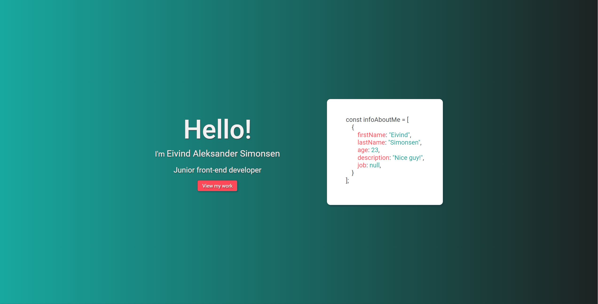
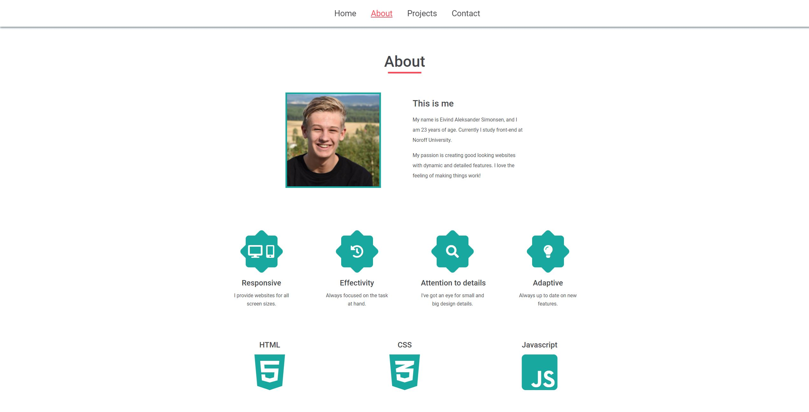

# My portfolio

> This project tells job seekers about who I am, and what skills I have. All my projects will be displayed here.
> Live demo [_here_](https://www.easimonsen.com). <!-- If you have the project hosted somewhere, include the link here. -->

## Table of Contents

- [General Info](#general-information)
- [Technologies Used](#technologies-used)
- [Features](#features)
- [Screenshots](#screenshots)
- [Setup](#setup)
- [Project Status](#project-status)
- [Room for Improvement](#room-for-improvement)
- [Contact](#contact)
<!-- * [License](#license) -->

## General Information

- This site is for job seeking purposes.
- A place where I can display my skills and previous projects.
<!-- You don't have to answer all the questions - just the ones relevant to your project. -->

## Technologies Used

- HTML5
- SASS
- Bootstrap - version 5.1.3
- Javascript

## Features

- Displays finished projects.

## Screenshots

<!-- If you have screenshots you'd like to share, include them here. -->

## Setup

No setup required.

## Project Status

Project is: _complete_. Site is finished built, will only add future projects to it.

## Room for Improvement

Include areas you believe need improvement / could be improved. Also add TODOs for future development.

Room for improvement:

- Fix contact form by using php.

To do:

- Learn php.

## Contact

Created by [@EivindSimonsen](https://www.linkedin.com/in/eivind-simonsen-9469121b9/) - feel free to contact me!
